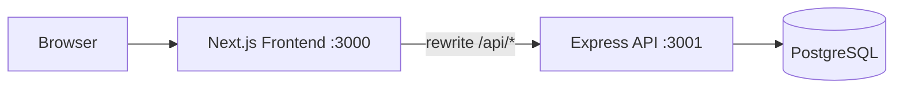

# Dept Timetable Project


A full-stack timetable platform for department operations. It combines an admin scheduling cockpit, teacher portal, and public timetable viewer with a conflict-aware backend and auto-scheduler.

## Why this project exists

Academic timetable planning breaks down fast when data is fragmented and conflict checks are manual. This project centralizes timetable operations into one system:

- Reliable conflict checks for teacher/room/lab occupancy.
- Role-based workflows (admin and teacher).
- Public timetable visibility without exposing admin controls.
- Academic-year lifecycle management and cloning.
- Auto-generation to speed up baseline scheduling.

## Repository structure

```text
dept-project/
   time-table-backend/   # Express + Prisma + PostgreSQL API
   timetable-light/      # Next.js frontend (admin, teacher, public views)
```

## Architecture



Notes:

- Frontend sends same-origin `/api/*` calls.
- Next.js rewrites proxy those calls to Express.
- Session auth is cookie-based (`tt_session`) and verified in both layers.

## Quick start (recommended)

### 1. Prerequisites

- Node.js >= 20
- npm >= 10
- PostgreSQL running locally

### 2. Backend setup

```bash
cd time-table-backend
npm install
```

Create `.env` from `.env.example`, then run:

```bash
npm run db:migrate
npm run db:seed
npm run dev
```

Backend runs at `http://localhost:3001`.

### 3. Frontend setup

Open a second terminal:

```bash
cd timetable-light
npm install
```

Create `.env.local` from `.env.example`, then run:

```bash
npm run dev
```

Frontend runs at `http://localhost:3000`.

### 4. First login

Default seed admin:

- Email: `admin@dept.local`
- Password: `changeme`

Change this for any non-local use.

## Environment checklist

### Backend (`time-table-backend/.env`)

- `DATABASE_URL` (required)
- `JWT_SECRET` (required)
- `PORT` (optional, default 3001)
- `JWT_EXPIRES_IN` (optional, default 7d)
- `CORS_ORIGIN` (optional)
- `ADMIN_EMAIL` (seed-only)
- `ADMIN_PASSWORD` (seed-only)

### Frontend (`timetable-light/.env.local`)

- `API_BACKEND_URL` (required in practice, should be backend URL)
- `JWT_SECRET` (required, must match backend)
- `NEXT_PUBLIC_API_BASE_URL` (optional fallback)

## Usage guide

### Admin workflow

1. Login at `/login`.
2. Create/manage master data in `/master-data`.
3. Create assignments in `/assignments`.
4. Build or auto-generate timetable in `/timetable-builder`.
5. Review class/teacher/room views in `/timetable-views`.
6. Manage years and advanced operations in `/settings`.

### Teacher workflow

1. Login with teacher account.
2. Open `/teacher-portal` for own subjects.
3. Open `/teacher-portal/timetable` for own schedule.

### Public workflow

- Open `/timetable` and select branch + semester.

## Key operational behavior

- Conflict checks happen on backend before timetable writes.
- Academic year scope is applied for key scheduling conflicts.
- Auto-scheduler uses a greedy two-pass approach and returns an audit report.
- PDF export is generated server-side via Puppeteer.

Detailed references:

- Backend guide: `time-table-backend/README.md`
- Frontend guide: `timetable-light/README.md`

## Remote access (smartphone viewing)

Two practical options:

### Option A: Same Wi-Fi network

1. Keep phone and laptop on same Wi-Fi.
2. Ensure Windows network profile is Private.
3. Start frontend bound to your LAN IP:

```bash
npm run dev -- -H 192.168.1.40
```

4. Open `http://192.168.1.40:3000/timetable` on phone.

### Option B: Cloudflare tunnel

1. Start frontend normally (`npm run dev`).
2. Run:

```bash
npx cloudflared tunnel --url http://localhost:3000
```

3. Open the generated `trycloudflare.com` URL.
4. Keep `allowedDevOrigins` aligned in frontend `next.config.ts`.

## Troubleshooting

1. Redirect loop or unauthorized behavior.
- Cause: `JWT_SECRET` mismatch between apps.
- Fix: set same secret in backend and frontend env files.

2. API calls fail from frontend.
- Cause: wrong `API_BACKEND_URL`.
- Fix: point it to backend (`http://127.0.0.1:3001` by default).

3. Timetable writes fail after fresh DB setup.
- Cause: migrations/seed not run, slot rows missing.
- Fix: run `npm run db:migrate` and `npm run db:seed`.

4. App hangs on Windows during local run.
- Cause: QuickEdit terminal freeze when clicking terminal window.
- Fix: focus terminal and press `Enter` or `Esc`.

5. Phone cannot reach app on LAN.
- Fix: open firewall for port 3000, confirm network profile is Private, and ensure backend is also running.

## Safety notes

- `db:seed` is destructive for existing data in local DB.
- Some admin endpoints are intentionally destructive (`clear-all`, `factory-reset`, year delete-all).
- Never commit real secrets to git; use env injection per environment.

## License

Project-internal/academic use unless defined otherwise by repository owner.
